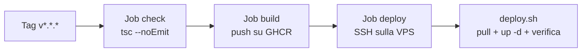

# Discord Bot — Deploy in produzione con GitHub Actions

## Panoramica

Il bot gira sulla stessa VPS di Kodama API, in un container che all'avvio esegue `npm start` (→ `ts-node src/app.ts`). Riusa l'infrastruttura di Kodama API: utente `deploy`, chiave SSH `kodama_deploy`, login a GHCR e gli stessi secret GitHub.



### Rete tra bot e Kodama API

Kodama API espone la porta 8080 solo su `127.0.0.1` dell'host, quindi un altro container non può raggiungerla da lì. I due stack condividono invece la rete bridge esterna `kodama-nest` (stesso nome usato in sviluppo):

| Container | Reti | Nome sulla rete `kodama-nest` |
| --- | --- | --- |
| `api` (Kodama API) | `default` + `kodama-nest` | `kodama-api` |
| `db` (PostgreSQL) | solo `default` | — non raggiungibile dal bot |
| `bot` | solo `kodama-nest` | — |

Il bot chiama `http://kodama-api:8080` direttamente, senza passare da Internet, Nginx o HTTPS. Il database resta isolato.

### File

| File nel repository | Dove finisce |
| --- | --- |
| `Dockerfile`, `.dockerignore` | Build dell'immagine su GitHub Actions |
| `.github/workflows/deploy.yml` | Pipeline |
| `docker-compose.prod.yml`, `deploy.sh` | Copia manuale in `/var/www/kodama-nest/discord-bot` sulla VPS |

Immagine: `ghcr.io/sakuragarden-community/discord-bot`.

## Parte 1 — Rete condivisa e aggiornamento di Kodama API

Una sola volta. Sulla VPS, come `deploy`:

```bash
sudo -iu deploy
docker network create kodama-nest
cd /var/www/kodama-nest/api
```

Aggiorna `docker-compose.prod.yml` e `deploy.sh` con le versioni presenti nel repository `kodama-api` (servizio `api` collegato a `kodama-nest` con alias `kodama-api`; `deploy.sh` crea la rete se manca). Poi applica la modifica:

```bash
bash -n deploy.sh && echo OK
docker compose -f docker-compose.prod.yml up -d
docker network inspect kodama-nest --format '{{range .Containers}}{{.Name}} {{end}}'
```

Viene ricreato solo il container `api` (il `db` non cambia configurazione). L'ultimo comando deve elencare il container dell'API.

## Parte 2 — Preparazione del bot sul server

Dalla tua sessione amministratore:

```bash
sudo mkdir -p /var/www/kodama-nest/discord-bot
sudo chown deploy:deploy /var/www/kodama-nest/discord-bot
```

Poi come `deploy`:

```bash
sudo -iu deploy
cd /var/www/kodama-nest/discord-bot
```

Copia qui `docker-compose.prod.yml` e `deploy.sh` dal repository, quindi:

```bash
chmod +x deploy.sh
bash -n deploy.sh && echo OK
```

Crea `.env`:

```env
BOT_TAG=latest
TOKEN=<token del bot Discord di produzione>
KODAMA_CLIENT_ID=discord-bot
KODAMA_CLIENT_SECRET=<stesso valore di KODAMA_SECURITY_BOOTSTRAP_CLIENTSECRET in /var/www/kodama-nest/api/.env>
```

```bash
chmod 600 .env
```

`KODAMA_API_BASE_URL` non va nel `.env`: è fissata in `docker-compose.prod.yml` a `http://kodama-api:8080`. `dotenv` nel container non trova alcun file `.env` e usa le variabili passate da Compose.

### Accesso a GHCR

Il login a `ghcr.io` fatto per Kodama API vale anche qui, perché le credenziali stanno in `~deploy/.docker/config.json`. Il PAT con `read:packages` legge il nuovo pacchetto se l'account che lo ha creato ha accesso al repository `discord-bot`. Dopo il primo build, verifica:

```bash
docker pull ghcr.io/sakuragarden-community/discord-bot:latest
```

Se risponde `unauthorized`: *sakuragarden-community → Packages → discord-bot → Package settings → Manage access* e aggiungi l'account del PAT con ruolo *Read*.

## Parte 3 — Secret su GitHub

Il repository `discord-bot` usa gli stessi secret di `kodama-api`, nell'environment `production`. GitHub non permette di rileggere i valori esistenti, quindi vanno impostati di nuovo con gli stessi valori. Dal PC locale, con `gh` autenticato:

```bash
REPO=sakuragarden-community/discord-bot

gh api -X PUT repos/$REPO/environments/production

gh secret set VPS_HOST        -R $REPO --env production --body "api.sakuragarden.it"
gh secret set VPS_PORT        -R $REPO --env production --body "22"   # o la porta SSH che usi
gh secret set VPS_USER        -R $REPO --env production --body "deploy"
gh secret set VPS_SSH_KEY     -R $REPO --env production < ~/.ssh/kodama_deploy
ssh-keyscan -p 22 api.sakuragarden.it | gh secret set VPS_KNOWN_HOSTS -R $REPO --env production
```

Consigliato, come per l'API: in *Settings → Environments → production* attiva **Required reviewers**.

### Se hai attivato la chiave limitata allo script (passo 4.4 di Kodama API)

Il `command=` forzato in `authorized_keys` permette solo il deploy dell'API. Sostituiscilo con uno smistatore che accetta i due script. Come amministratore crea `/home/deploy/bin/deploy-dispatch.sh`:

```bash
#!/usr/bin/env bash
set -euo pipefail
read -r -a ARGS <<< "${SSH_ORIGINAL_COMMAND:-}"
[[ ${#ARGS[@]} -eq 2 ]] || { echo "Uso: <script> <tag>" >&2; exit 1; }
case "${ARGS[0]}" in
  /var/www/kodama-nest/api/deploy.sh|/var/www/kodama-nest/discord-bot/deploy.sh)
    exec "${ARGS[0]}" "${ARGS[1]}" ;;
  *) echo "Comando non consentito" >&2; exit 1 ;;
esac
```

```bash
sudo chown root:root /home/deploy/bin/deploy-dispatch.sh
sudo chmod 755 /home/deploy/bin/deploy-dispatch.sh
```

E in `/home/deploy/.ssh/authorized_keys`:

```text
command="/home/deploy/bin/deploy-dispatch.sh",no-pty,no-port-forwarding,no-agent-forwarding ssh-ed25519 AAAA... github-actions-kodama
```

Se non hai attivato il passo 4.4, salta questa sezione.

## Parte 4 — Primo rilascio

Checklist:

- [ ] Rete `kodama-nest` creata e container `api` collegato (Parte 1)
- [ ] `/var/www/kodama-nest/discord-bot` contiene `docker-compose.prod.yml`, `.env` (600) e `deploy.sh` eseguibile
- [ ] Secret dell'environment `production` impostati nel repository `discord-bot`
- [ ] `Dockerfile`, `.dockerignore` e `.github/workflows/deploy.yml` su `main`
- [ ] Il bot di sviluppo non usa lo stesso `TOKEN` di produzione (Discord accetta più sessioni, ma il bot risponderebbe due volte)

```bash
git tag v0.1.0
git push origin v0.1.0
```

In alternativa: *Actions → Deploy → Run workflow* su `main` (tag immagine `sha-<commit>`).

### Cosa verifica `deploy.sh`

1. Crea la rete `kodama-nest` se manca.
2. Aggiorna `BOT_TAG` nel `.env`, scarica l'immagine e riavvia il container.
3. Dopo 30 secondi controlla che il container sia `running` con **zero riavvii**. Il bot non espone HTTP, quindi è il segnale più affidabile: un token errato o un crash all'avvio fanno ripartire il container.
4. Se il controllo fallisce, stampa gli ultimi 100 log su GitHub Actions e torna al tag precedente.
5. Dall'interno del container chiama `http://kodama-api:8080/actuator/health`: se Kodama API non risponde stampa un avviso, senza bloccare il deploy.

## Parte 5 — Rilasci, rollback e comandi utili

Rilasci successivi: nuovo tag SemVer (`v0.2.0`, …).

Rollback manuale, come `deploy`:

```bash
/var/www/kodama-nest/discord-bot/deploy.sh 0.1.0
```

Comandi utili in `/var/www/kodama-nest/discord-bot`:

```bash
docker compose -f docker-compose.prod.yml ps
docker compose -f docker-compose.prod.yml logs -f bot
docker compose -f docker-compose.prod.yml restart bot

# Test del collegamento con l'API dal container del bot
docker compose -f docker-compose.prod.yml exec bot \
  node -e "fetch('http://kodama-api:8080/actuator/health').then(r=>r.text()).then(console.log)"
```

### Se la pipeline fallisce

| Sintomo | Causa probabile | Soluzione |
| --- | --- | --- |
| `network kodama-nest declared as external, but could not be found` | Rete non creata | `docker network create kodama-nest` |
| `Bot non stabile (stato/riavvii: running 1)` | Token Discord errato o eccezione all'avvio | Leggi i log nel job, correggi `.env` o il codice |
| `getaddrinfo ENOTFOUND kodama-api` nei log | Container `api` non collegato a `kodama-nest` | Parte 1 |
| `401` dal token endpoint | `KODAMA_CLIENT_SECRET` diverso dal segreto di bootstrap dell'API | Allinea i due `.env` |
| `unauthorized` nel pull | Accesso al pacchetto GHCR | Parte 2, Accesso a GHCR |
| `Host key verification failed` | `VPS_KNOWN_HOSTS` errato | Rigenera con `ssh-keyscan -p <porta>` |
